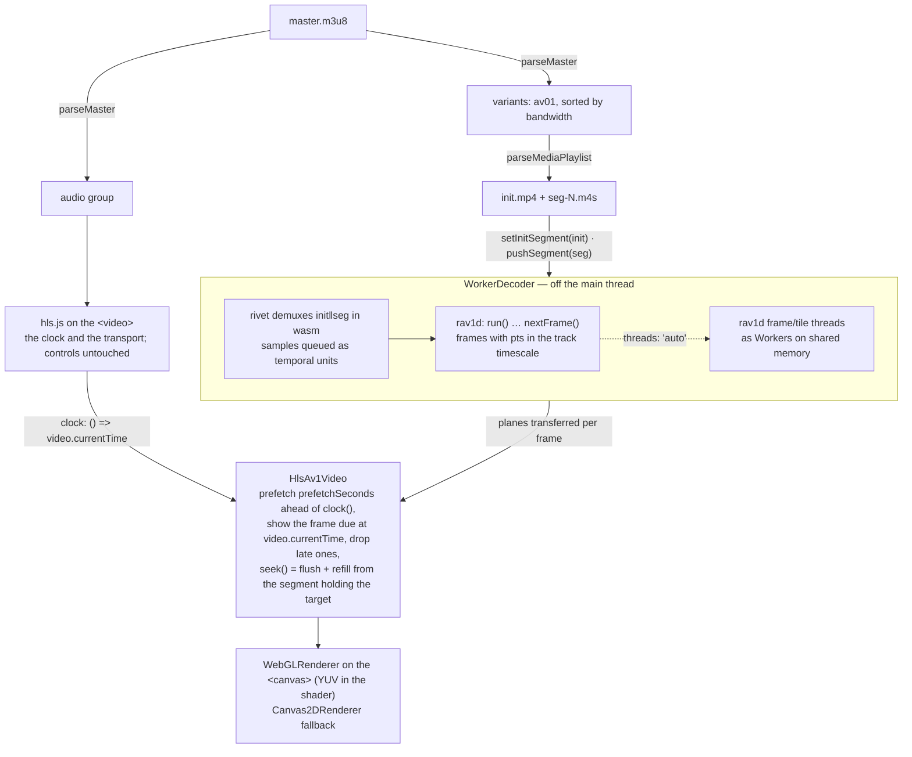
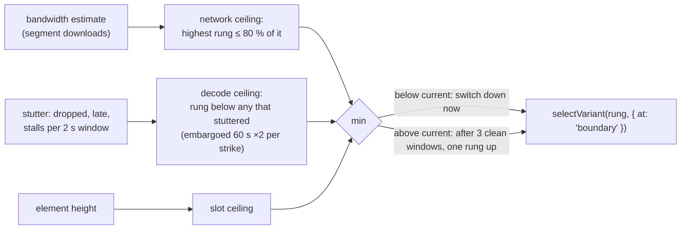

# Integrating the decoder into a video player

What a site that serves AV1 needs in order to keep playing on browsers
without an AV1 decoder — older phones and laptops without hardware AV1, and
Safari before AV1 hardware — using this package as the fallback. It assumes
HLS/CMAF (fragmented MP4) delivery, which is what most ladders are; the
whole-file paths (`Av1Player.load(bytes)`) are covered in the README.

## The decision

```js
import { chooseVariant } from '@safewords/wasm-av1';

const av1 = 'video/mp4; codecs="av01.0.05M.08"';
const native = window.MediaSource?.isTypeSupported(av1)
  || document.createElement('video').canPlayType(av1) !== '';
// Better still: navigator.mediaCapabilities.decodingInfo({ type: 'media-source',
//   video: { contentType: av1, width, height, bitrate, framerate } })
//   → { supported, smooth, powerEfficient }: fall back when !supported, consider it when !smooth.
if (!native && chooseVariant()) useWasmFallback();
```

`chooseVariant()` is null on engines older than the baseline build (Safari
< 15, Chrome < 96); there is nothing to do for those. Keep a query-string
override (`?av1=wasm`) so the fallback can be exercised on any machine.

## The shape: keep the `<video>`, add a `<canvas>`

Keep the `<video>` element as the transport and the clock — play/pause,
seeking, `currentTime`, volume, controls and every listener stay as they are —
and give it only the **audio** rendition (hls.js plays AAC everywhere). A
video-only stream gets a synthesized silent audio track of the same duration
so `currentTime`, `duration` and `ended` stay real. Beside the `<video>`, a
`<canvas>` receives the AV1 video rendition, decoded in a Worker and painted
by WebGL whenever `video.currentTime` says a frame is due:

```js
import { HlsAv1Video, parseMaster } from '@safewords/wasm-av1';

const master = parseMaster(await (await fetch(masterUrl)).text(), masterUrl);
const audio = master.audio.find((a) => a.isDefault) ?? master.audio[0];
hls.loadSource(audio.url);                       // hls.js on the <video>: the clock

const v = new HlsAv1Video(canvas, {
  clock: () => video.currentTime,
  worker: true,                                  // decode + demux off the main thread
  threads: 'auto',                               // rav1d worker threads, where the page is isolated (below)
  baseUrl: '/wasm-av1/',                         // where pkg/ is served
  workerUrl: '/wasm-av1/js/worker.js',           // where js/ is served (see "Serving")
  fetchText, fetchBytes,                         // add credentials for your media host if needed
  prefetchSeconds: 8,
});
await v.selectVariant(master.variants.find((x) => x.av1 && x.height <= 720));
v.start();
video.addEventListener('seeking', () => v.seek(video.currentTime));
```



Every CMAF segment starts on a keyframe, so a seek lands on the segment
holding the target and drops the frames before it (at most one segment).

## Which rung: measure both, take the lower

Two things bound the rung, and `HlsAv1Video` measures both so the player can
take the intersection:

- **Network.** `stats.bandwidth` is a bits/s estimate from the player's own
  segment downloads (hls.js-style: two EWMAs, the estimate is the lower —
  a slow-down is believed at once, a burst is not);
  `variantForBandwidth({ factor: 0.8, maxHeight })` is the highest rung whose
  declared BANDWIDTH fits under it. `stats.bufferAhead` (seconds of segments
  pushed beyond the clock) running low, or `stats.slowFetches` growing
  (a download slower than the segment it carried), means step down now.
- **Decode/render.** Stutter as the viewer sees it, beyond
  `framesDropped`: `stats.lateFrames` (a frame painted more than one frame
  interval after it was due — a hitch), `stats.stalls` / `stallMs` (nothing
  buffered while the clock ran past the last frame: the decoder is not
  keeping up). Any stall, or dropped+late over ~8 % of a 2 s window, is a
  strike against the rung: step down and keep off that height for a while
  (60 s, doubling per strike) so you do not bounce straight back to it.
- **Element size.** Never above the rung that fills the element.

Step **up** only after a few clean windows in a row (under 2 % dropped+late,
no stall, network fine), one rung at a time. Start on a rung the device can
plainly do (a laptop: 720p; a phone: 360p/480p). Single-threaded, the SIMD
build decodes 720p at ~110 fps and 1080p at ~60 fps on a laptop
(docs/performance.md); an old phone is 3–8× slower.



### Switching without a gap

`selectVariant(rung)` while playing switches **at the next segment boundary
the decoder has not reached** — segments already pushed past it are
un-queued and re-fetched from the new rung, the new init segment goes in,
decoding never stops and nothing decoded is lost; the picture changes rung a
segment later with no freeze (all rungs of a ladder start their segments on
keyframes at the same times, which is what makes this exact). It resolves to
`'boundary'`, or `'none'` when the decoder already holds everything to the
end (nothing left to switch), or `'now'` if the playlists are not
segment-aligned and it fell back to the hard switch — `{ at: 'now' }` asks
for that directly: flush and refill from the segment holding the clock,
which shows as a short freeze while it decodes up to the clock again.

## Threads

`threads: 'auto'` (one per logical core, at most 8) multiplies decode speed
by 3–5× on 4–8 cores and, more visibly, brings the worst single frame down —
1080p from 96 ms to 26 ms in Chromium. It needs `SharedArrayBuffer`, i.e. a
**cross-origin-isolated document**: `Cross-Origin-Opener-Policy: same-origin`
plus a `Cross-Origin-Embedder-Policy`. Which COEP value depends on where your
media comes from:

- `require-corp` isolates every engine (Chrome 83+, Firefox 79+, Safari
  15.2+) but requires every cross-origin subresource loaded without CORS
  (``, `<video poster>`, CSS images…) to carry
  `Cross-Origin-Resource-Policy: cross-origin` (or `same-site`). If media
  comes from a CDN/host you control, add that header there; presigned URLs
  straight from an object store cannot carry it, and any such `` breaks.
- `credentialless` (Chrome 96+, Firefox 119+; not Safari) instead sends
  no-cors cross-origin loads without credentials and needs no CORP header —
  the safe choice when media is on hosts you cannot add headers to. Safari
  ignores it and stays un-isolated: nothing breaks, the fallback is
  single-threaded there.

Without isolation nothing breaks either: `detectThreads()` is false, the
single-thread build loads, `stats.threads` is 1. Note `COOP: same-origin`
severs `window.opener` for cross-origin popups — check OAuth-in-a-popup flows.
The decoder must be in a Worker for threads (`worker: true`; the player
forces this).

## Serving

`pkg/` is ~1.7–1.8 MB per variant (~600 KB gzipped); one variant is fetched,
lazily, only after the decision above says so. Serve `pkg/` as static files
from your own origin (no CORS on the `.wasm`, and a Worker inherits the
page's isolation), under a path that carries the package version so it caches
immutably, and pass `baseUrl`. The `.wasm` must be files, not bundled. For
the Worker, either let the bundler resolve `new Worker(new URL('./worker.js',
import.meta.url))` or — more predictably — serve `js/` statically too and pass
`workerUrl` (its imports are relative). With Vite, a small plugin that copies
`node_modules/@safewords/wasm-av1/{pkg,js}` into `dist/wasm-av1/<version>/`
and defines the base URL is all it takes.

## Not in scope of the fallback

Captions, DRM, and audio decoding (the browser does AAC natively everywhere).
